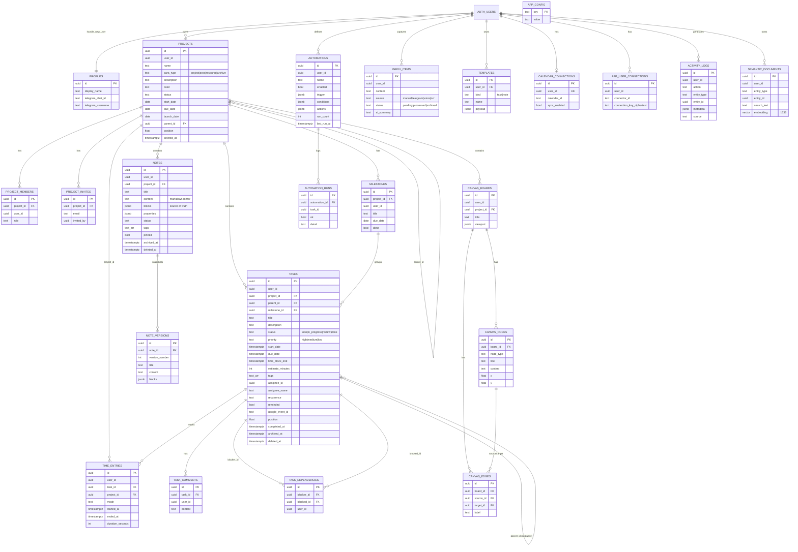

# Second Brain

[](https://github.com/ilramdhan/second-brain/actions/workflows/ci.yml)
[](https://github.com/ilramdhan/second-brain/actions/workflows/codeql.yml)
[](https://github.com/ilramdhan/second-brain/releases/latest)
[](LICENSE)

A personal and team **task & notes management PWA**: capture thoughts quickly (text, voice, photo, Telegram), let AI turn raw brain dumps into structured tasks and notes, then plan the work across list, kanban, calendar and Gantt-style timeline views. A block-based notes editor provides bidirectional links, block references, a graph view and live collaboration.

Built with TanStack Start (React 19 SSR + server functions) on Supabase (Postgres + Auth + Realtime). It runs on the **Vercel free (Hobby) + Supabase free** tiers. The project was originally scaffolded with Lovable and no longer depends on it.

> The default UI language is Indonesian, and you can switch to English in Settings. AI prompts and Telegram bot replies are in Indonesian.

---

## Table of contents

1. [Why Second Brain](#why-second-brain)
2. [Features](#features)
3. [Tech stack](#tech-stack)
4. [Architecture](#architecture)
5. [Directory structure](#directory-structure)
6. [Data model](#data-model)
7. [Environment variables](#environment-variables)
8. [Local setup](#local-setup)
9. [Scripts](#scripts)
10. [Database migrations](#database-migrations)
11. [Deployment to Vercel](#deployment-to-vercel)
12. [Integrations](#integrations)
13. [Testing](#testing)
14. [Git history](#git-history)
15. [Contributing / Community](#contributing--community)
16. [License](#license)

---

## Why Second Brain

- **Capture everywhere, sort later.** Every input (typed, spoken, photographed or sent from Telegram) lands in one Inbox. AI then splits it into tasks, issues and notes and groups them by project.
- **One task model, many views.** List, kanban, calendar and timeline views all read the same query cache. A change in one view appears in all of them right away.
- **Notes that connect.** Block-level IDs make `[[wiki links]]`, `((block references))`, transclusion, backlinks, a note graph and Dataview-style queries possible without extra tables.
- **Built for teams.** You can share projects with collaborators by email. Row Level Security (RLS) controls access to tasks, notes, milestones, comments and canvases in shared projects.
- **Safe by default.** Deletes are soft (trash with 30-day retention), archived items can be restored, notes keep version snapshots, a database trigger writes an activity audit log, and you can export everything to a JSON backup.

---

## Features

### Landing page (`/`)

A public, server-rendered bento-grid page that introduces the app (hero, sign-in and GitHub links, feature cards with lightweight HTML/SVG mockups). Signed-in visitors are forwarded to `/today`.

### Today dashboard (`/today`)

A daily agenda that shows overdue tasks, tasks due today and this week, upcoming milestones and pending inbox items.

### Inbox & AI brain-dump processing (`/inbox`)

- Inbox items come from manual entry, Telegram, voice or OCR (`inbox_items.source`).
- **AI → structure** (`parseBrainDump`): the AI splits an item into separate `task` / `issue` / `note` entries. Each entry gets a priority, an ISO due date (relative dates like "besok"/"Jumat" are resolved), 1–3 tags, a short paraphrased description and a project name. The parser matches existing projects by name and creates missing ones. Tasks and notes are then inserted, and the item is marked `processed`.
- **Paraphrase** (`paraphrasePoint`): expands a terse point into a 2–4 sentence description. The original text is kept in `ai_summary`.
- You can archive items.

### Quick capture (global)

- A floating capture button (center of the mobile bottom nav) and a capture sheet in `QuickCapture.tsx`:
  - **Text**: saved straight to the Inbox.
  - **Voice**: records with `MediaRecorder`, then transcribes server-side (`transcribeVoice`, max 10 MB).
  - **Photo / OCR**: extracts text from whiteboard photos or handwriting (`ocrImage`) and marks unreadable parts with `[?]`.
- **Quick task** (press `Q` anywhere outside an input): one-line task entry with a live natural-language preview (see NLP below).

### Natural-language task parsing (`src/lib/nlp.ts`)

A local regex parser for Indonesian and English. It makes no AI call and costs nothing. It extracts:

- Dates: `hari ini/today`, `besok/tomorrow`, `lusa`, `minggu depan/next week`, `bulan depan`, `3 hari lagi`, `in 2 weeks`, weekdays (`senin`, `friday`, `jumat depan`), `12 agustus 2026`, `12/8`, `tgl 12`
- Time: `jam 10 pagi`, `14:30`, `7pm`, `nanti malam`
- `#tag`, `@assignee`, `+Project`, priority `!tinggi` / `!high` / `p1`
- Recurrence: `setiap hari`, `every week`, `tiap bulan`

Example: `Meeting evaluasi besok jam 10 pagi #urgent @budi !tinggi +Website`

### Tasks (`/tasks`, project pages)

- Fields: title, description, status (`todo` → `in_progress` → `review` → `done`), priority, start and due dates, tags, project, milestone, assignee (a project member or a free-text name), estimate in minutes, time-block end, recurrence (daily, weekly or monthly).
- **Views**: list, kanban board (drag & drop with `@dnd-kit`), and upcoming. You can filter by search, status, priority, project, tag and assignee.
- **Subtasks** (`parent_id`). Deleting a parent also soft-deletes its subtasks, and restoring the parent restores them.
- **Comments** on each task (`task_comments`). Automations can also post comments.
- **Recurring tasks**: when you complete a recurring task, the app creates the next occurrence with its dates shifted.
- **Single editor**: the global `TaskDialogProvider` handles all task creation and editing from every view. It also hosts dependencies, subtasks, comments, the focus timer and Google Calendar sync.

### Task dependencies

- `task_dependencies` stores blocker → blocked pairs.
- **Blocked check**: you cannot move a task out of `todo` while it still has an open blocker. The UI shows "Terkunci" (locked).
- **Cycle rejection**: adding a dependency that would create a loop is rejected on the client.
- **Auto-shift**: pushing a blocker's due date later shifts every transitive dependent's start and due dates by the same amount.
- **Unblock notifications**: when a blocker is completed, the assignees (or owners) of freed tasks get a Telegram message (`notifyUnblocked`).

### Calendar (`/calendar`)

Day, week, month and year views. Drag a task to another day to move it, or drag its edge to change its duration (`@dnd-kit`).

### Timeline / Gantt (`/timeline`, project tab)

A Gantt-style timeline of projects, tasks, milestones and launch dates, with a "today" marker. You can drag bars to move them and use pointer events to resize either end.

### Projects & teams (`/projects`, `/projects/$projectId`)

- **PARA** classification (`project` / `area` / `resource` / `archive`), status, color, start, due and launch dates.
- Nested projects (`parent_id`) with **grid, kanban and tree** views.
- Each project page has tabs for overview, tasks, milestones, timeline, notes and team.
- **Sharing**: the owner invites people by email (`project_invites`). When an invited user signs in, `accept_project_invites()` turns the invitation into a `project_members` row. Members see and edit the project's tasks, notes, milestones and canvases; only the owner edits or deletes the project itself, and only a row's creator or the project owner can trash or delete it. `list_project_people()` resolves names and emails.

### Notes (`/notes`, `/notes/$noteId`)

- Notes list in **grid or kanban** (by note status), with pinning and tags.
- **Block editor** (`BlockEditor.tsx`): paragraph, H1–H3, to-do, bullet, numbered, quote, code, divider, query and embed blocks. It supports Markdown shortcuts (`#`, `-`, `[]`, `>`, ` ``` `, `---`) and a slash menu.
- **Links**: `[[Note title]]` wiki links and `((blockId))` block references. **Embed blocks** transclude (mirror) another block.
- **Backlinks**: shows the notes that link to the current note or reference its blocks.
- **Properties**: key/value metadata (`notes.properties`) that queries can use.
- **Query blocks** (Dataview-like), evaluated on the client:
  `TABLE rating, genre FROM #buku WHERE rating > 4 AND genre = fiksi SORT rating DESC LIMIT 10`
  `LIST FROM "Project name"`, `TABLE status FROM tasks WHERE status != done`
- **AI meeting minutes** (`summarizeMeeting`): turns raw notes into Markdown minutes (summary, discussion points, action items).
- **Version history**: a database trigger snapshots the previous version at most every 10 minutes. You can restore any snapshot from a side sheet.
- Storage: `notes.blocks` (jsonb) is the source of truth. Markdown is mirrored into `notes.content` for search and AI.

### Real-time collaboration

When several users open the same note, edits sync through **Yjs** updates over a private Supabase Realtime channel (`note-collab:<noteId>`) that only the note's owner and project members can join. Presence shows how many people are active, and live cursors are rendered. Durable state is still saved to `notes.blocks`.

### Graph view (`/graph`)

An interactive force-directed graph (`d3-force`) of notes, with edges from wiki links and block references.

### Canvas (`/canvas`)

A basic visual board: add idea cards, edit their title and content, select two cards to connect them, and delete cards. Data lives in `canvas_boards`, `canvas_nodes` and `canvas_edges`. You can only edit your own nodes. (A richer infinite canvas with media embeds is still on the roadmap.)

### Automations (`/automations`)

If-this-then-that rules for tasks, evaluated server-side in `runAutomations`:

- **Triggers**: task created, status changed (optionally to a specific value), priority changed, assignee changed, due date changed.
- **Conditions**: priority, status, project, tag or assignee, with `eq`, `neq` or `contains`.
- **Actions**: set a field (priority, status or assignee), add a tag, shift the due date by N days, post a comment, send a Telegram message, or POST a JSON payload to an **HTTPS webhook** (payload `{ text, content, rule, event, project, task }`, compatible with Slack, Discord and n8n).
- Templates support `{{title}} {{status}} {{priority}} {{assignee}} {{project}} {{due}}`.
- Each run is logged to `automation_runs`, and `run_count` and `last_run_at` are updated. Actions write directly to the database, so they never trigger rules again.

### Focus timer & reports (`/reports`)

- A Pomodoro timer inside the task dialog counts down from the task's `estimate_minutes` and saves sessions to `time_entries`.
- Weekly report of focus time per project and per task (Recharts).

### Google Calendar (per user)

In **Settings**, each user connects their own Google Calendar through a popup Google OAuth 2.0 flow owned by the deployment (authorization code + PKCE, `access_type=offline`, scope `calendar.events` only). The refresh token is encrypted with AES-GCM (`TOKEN_ENCRYPTION_KEY`) and stored server-side in `app_user_connections`, so it never reaches the browser; access tokens are refreshed on the server and the token is revoked on disconnect. From the task dialog, you can push a scheduled task to Google Calendar as an event. The event is created the first time and updated after that (`tasks.google_event_id`).

### Telegram bot

- Users link their account in **Settings → Bot Telegram → Hubungkan Telegram**, which shows a one-time code (valid for 10 minutes, single use), and send `/link <code>` to the bot. After that, any message they send goes to their Inbox.
- The app talks to the Telegram Bot API directly with `TELEGRAM_BOT_TOKEN`. With `TELEGRAM_BOT_USERNAME` set, Settings also shows a one-tap `t.me/<bot>?start=<code>` link.
- Two modes (a bot has one webhook): **app mode** (webhook → `/api/public/telegram/webhook`: `/start`, `/link`, text → Inbox) or **n8n mode** (webhook → n8n workflow 01 → `/api/public/n8n/bot`: all commands, inline buttons, OCR, voice).
- Deadline reminders and digests are sent on a schedule (n8n `POST /api/public/n8n/reminders` every 15 minutes, or the `/api/public/hooks/reminders` fallback).
- Automations and unblock notifications can also send Telegram messages.

### Templates, archive & trash

- **Templates** (`/templates`): reusable task or note templates (`templates` table).
- **Archive** (`archived_at`) and **Trash** (`deleted_at`, soft delete) for tasks and notes. Projects support trash only. The `/archive` page restores items, permanently deletes them, and purges trash items older than **30 days**.

### Activity log (`/activity`)

A full audit trail. Database triggers on every main table log insert, update and delete actions, including the names of changed fields but never note or task content. The app also logs auth events (sign-in, sign-out, idle timeout).

### Settings (`/settings`)

- Theme (light, dark or system) and language (Indonesian or English).
- **Idle auto sign-out** after N minutes. Activity in any tab resets the timer.
- Telegram link status and unlink, Google Calendar connect and disconnect.
- **JSON backup and restore** (projects, tasks, notes, milestones, dependencies, automations). Restoring never deletes existing data.

### Command menu

Press `Cmd/Ctrl + K` to search tasks, projects and notes and jump to them, or to create a new task.

### PWA

`manifest.webmanifest` makes the app installable (standalone mode, maskable icons). `public/sw.js` caches the app shell and static images, fonts and the manifest, and falls back to the cached shell when a page is opened offline. Server function and `/api/` requests are never cached.

### Authentication

Supabase email/password sign-up and sign-in (`/login`). Every page under the `_authenticated` layout redirects to `/login` when there is no session.

---

## Tech stack

| Layer              | Technology                                                                                                    |
| ------------------ | ------------------------------------------------------------------------------------------------------------- |
| Framework          | [TanStack Start](https://tanstack.com/start) 1.168 (SSR, file-based routing, server functions, server routes) |
| UI                 | React 19, Tailwind CSS 4, shadcn/ui (Radix primitives), lucide-react, sonner, cmdk, vaul                      |
| Data fetching      | TanStack Query 5 (shared cache, optimistic updates)                                                           |
| Routing            | TanStack Router 1.170 (generated `routeTree.gen.ts`)                                                          |
| Build              | Vite 8 (rolldown) with an explicit `vite.config.ts`, Nitro 3 (server bundling, `vercel` preset by default)    |
| Backend / DB       | Supabase: Postgres + RLS, Auth, Realtime (broadcast/presence), `pgvector`                                     |
| Migrations         | Hand-written SQL in `drizzle/migrations` tracked by drizzle-kit                                               |
| Drag & drop        | `@dnd-kit/core` / `sortable`                                                                                  |
| Collaboration      | Yjs over Supabase Realtime                                                                                    |
| Graph              | d3-force                                                                                                      |
| Charts             | Recharts                                                                                                      |
| AI                 | Vercel AI SDK (`ai`, `@ai-sdk/openai`): OpenAI or any OpenAI-compatible API (OpenRouter, Groq, Gemini, ...)   |
| Forms / validation | react-hook-form, zod                                                                                          |
| Dates              | date-fns 4                                                                                                    |
| Testing            | Vitest 4, Testing Library, jsdom                                                                              |
| Lint / format      | ESLint 9 (typescript-eslint, react-hooks), Prettier                                                           |
| Package manager    | Bun (`bun.lock`, `bunfig.toml` with a 24 h minimum-release-age guard)                                         |

---

## Architecture

```
Browser (React 19 + TanStack Query)
 │  ├─ Supabase JS client ──────────────► Supabase Postgres (RLS enforced, anon/publishable key + user JWT)
 │  ├─ Supabase Realtime channel ───────► note-collab:<id> (Yjs updates, presence, cursors)
 │  └─ server function RPC (+ Bearer JWT via attachSupabaseAuth)
 ▼
TanStack Start server (Nitro)
 ├─ src/start.ts         global middleware: error page, CSRF (server fns), auth header attacher
 ├─ src/server.ts        SSR entry wrapper (normalizes swallowed h3 errors into an HTML 500 page)
 ├─ *.functions.ts       createServerFn + requireSupabaseAuth → per-request Supabase client as the user
 │     ai.functions.ts, automations.functions.ts, googleCalendar.functions.ts
 ├─ *.server.ts          server-only helpers (AI provider, Telegram Bot API, Google OAuth, AES-GCM)
 └─ src/routes/api/public/*   HTTP endpoints with their own auth (Telegram webhook, reminder cron,
                              n8n/* behind x-api-key)
        └─ supabaseAdmin (service role) — bypasses RLS, used only on the server
 ▼
External: AI provider (OpenAI-compatible) · Telegram Bot API · Google OAuth + Calendar API · n8n (schedules, bot relay, backups) · user webhooks
```

### Data flow

- **Reads and writes from the client** go through hooks in `src/features/<entity>/` (re-exported by `src/lib/data.ts`) (`useTasks`, `useProjects`, `useNotes`, `useMilestones`, `useDeps`, `useAutomations`, plus `use*Actions`). They share TanStack Query keys (`tasks`, `projects`, `notes`, `milestones`, `deps`, `automations`), so list, kanban, calendar and timeline update together. Updates are optimistic (`setQueryData`) and then invalidated.
- **Task mutations** all go through `useTaskActions()`. It handles blocked checks, auto-shifting dependents, recurring tasks, unblock notifications, and triggering `runAutomations` after create and update.
- **List hooks exclude** soft-deleted (`deleted_at`) and archived (`archived_at`) rows. `/archive` queries them directly.
- **Long lists** paginate on the client with `usePaged` / `LoadMore`.

### Server functions & auth

- `attachSupabaseAuth` (a global function middleware) adds the user's access token to every server-function RPC.
- `requireSupabaseAuth` validates the JWT (`auth.getClaims`) and gives handlers `context.supabase` (a client acting as the user, so RLS still applies) and `context.userId`.
- `supabaseAdmin` (service role, `client.server.ts`) is used only where RLS must be bypassed: the Telegram webhook, the reminder cron, reading other users' Telegram chat IDs for unblock notifications, and the encrypted connection store.
- CSRF middleware protects server functions.

### Row Level Security

- Every table has RLS enabled. Owner policies use `auth.uid() = user_id`.
- Team access uses the **security-definer** helpers `is_project_owner`, `is_project_member`, `can_access_task`, `can_access_note` and `can_access_canvas_board`. These avoid recursive policies. Tasks, notes, milestones, canvases, comments, dependencies and note versions in a shared project are visible to all members.
- Shared rows use separate select/insert/update/delete policies (migration `0010`):
  - Inserts require `user_id = (select auth.uid())` and membership of the target project.
  - Members may edit and archive tasks, notes, milestones and boards in a shared project, but `user_id` can never change (a `BEFORE UPDATE` trigger) and rows can only move into projects the user belongs to.
  - Trashing/restoring (`deleted_at`) and hard deletes are limited to the row's creator or the project owner. Canvas nodes and edges are edited only by their author.
  - Only the project owner can update or delete a project, so members cannot take it over.
- RLS regression checks live in `supabase/tests/rls_phase1.sql`.
- `app_config` and `app_user_connections` have no policies, so only the service role can read them.

### Realtime

Only note collaboration uses Realtime: broadcast events `y-update` and `cursor`, plus presence on the **private** channel `note-collab:<noteId>`. Realtime Authorization policies on `realtime.messages` (migration `0009`) allow joining, receiving and sending only for the note's owner and members of its project (`can_access_note`). Other views stay in sync through the TanStack Query cache, not `postgres_changes`.

### Database-side automation

- `handle_new_user` trigger creates a `profiles` row on sign-up.
- `audit_row_change` triggers write to `activity_logs`.
- `snapshot_note_change` writes `note_versions` (throttled to 10 minutes).

---

## Directory structure

```
.
├── AGENTS.md                  # Architecture rules (authoritative; read first)
├── CLAUDE.md                  # Guide for Claude Code
├── roadmap.md                 # Feature roadmap / status
├── package.json               # Scripts and dependencies (Bun)
├── vite.config.ts             # Vite + TanStack Start + Nitro config (server entry → src/server.ts)
├── vitest.config.ts           # Vitest (jsdom, @ alias)
├── drizzle.config.ts          # drizzle-kit config (DATABASE_URL)
├── drizzle/
│   ├── schema.ts              # Intentionally blank (auto-generated placeholder)
│   └── migrations/            # 0000–0012 SQL migrations + meta journal/snapshots
├── supabase/config.toml       # Supabase project id
├── supabase/tests/            # SQL regression checks (RLS, rate limits, n8n helpers)
├── integrations/n8n/          # n8n workflow templates (bot, schedules, backup, calendar, email)
├── public/
│   ├── manifest.webmanifest   # PWA manifest
│   ├── sw.js                  # Service worker (shell + static asset cache)
│   ├── favicon.ico/.svg/.png, apple-touch-icon.png, icon-192/512(-maskable).png, og-image.png
│   └── robots.txt, sitemap.xml   # brand images are rendered from scripts/brand/*.svg
└── src/
    ├── server.ts              # SSR entry wrapper with error page fallback
    ├── start.ts               # TanStack Start instance: global middleware
    ├── router.tsx             # Router + QueryClient factory
    ├── routeTree.gen.ts       # GENERATED route tree — do not edit
    ├── styles.css             # Tailwind 4 theme tokens
    ├── routes/
    │   ├── __root.tsx         # HTML shell, meta, manifest, SW registration, providers
    │   ├── index.tsx          # Public landing page (SSR bento grid; signed-in visitors → /today)
    │   ├── login.tsx          # Email/password sign-in & sign-up
    │   ├── _authenticated.tsx # Auth guard + app shell (sidebar, mobile nav, command menu, quick capture, idle logout)
    │   ├── _authenticated/    # today, inbox, tasks, calendar, timeline, projects.*, notes.*,
    │   │                      # graph, canvas, automations, reports, templates, archive, activity, settings
    │   ├── oauth/google-calendar/return.tsx   # OAuth popup return → postMessage to opener
    │   └── api/public/
    │       ├── telegram/webhook.ts            # Telegram bot webhook, app mode (POST)
    │       ├── hooks/reminders.ts             # Deadline reminder cron endpoint (GET/POST)
    │       └── n8n/*                          # bot, capture, digest, reminders, maintenance, backup,
    │                                          # calendar/sync, events (x-api-key = N8N_API_KEY)
    ├── server/
    │   ├── tokenCrypto.server.ts              # AES-GCM encryption of stored tokens (TOKEN_ENCRYPTION_KEY)
    │   ├── googleOAuth.server.ts              # Google OAuth 2.0 + PKCE, encrypted state, refresh/revoke
    │   ├── googleCalendar.server.ts           # Per-user token store + Calendar event upsert/delete
    │   ├── automationEngine.server.ts         # Automation rule engine (browser + n8n paths)
    │   ├── reminders.server.ts, telegramLink.server.ts
    │   ├── n8n/                               # n8n endpoint auth, zod schemas, services, digests
    │   └── cronAuth, rateLimit, ssrf, securityHeaders, telegram* helpers
    ├── lib/
    │   ├── data.ts                # Query hooks, CRUD/soft-delete, task actions, dependencies, date helpers
    │   ├── automations.functions.ts # runAutomations / notifyUnblocked server fns
    │   ├── automation-types.ts    # Shared trigger/condition/action types
    │   ├── ai.functions.ts        # AI server fns (brain dump, paraphrase, minutes, transcribe, OCR)
    │   ├── ai.server.ts           # AI provider client (AI SDK, AI_* env)
    │   ├── googleCalendar.functions.ts # Google Calendar connect/disconnect/status/sync server fns
    │   ├── telegram.server.ts     # Telegram Bot API client (TELEGRAM_BOT_TOKEN)
    │   ├── blocks.ts              # Block model, markdown, links/refs, graph, query engine
    │   ├── nlp.ts                 # Natural-language task parser (ID/EN)
    │   ├── preferences.tsx        # Theme + locale provider and i18n strings
    │   ├── activity.ts            # log_activity RPC helper
    │   ├── constants.ts           # Status/priority/PARA/recurrence/color enums
    │   └── error-*.ts, error-reporting.ts, utils.ts
    ├── components/
    │   ├── ui/                    # shadcn/ui primitives
    │   ├── common/                # PageContainer, PageHeader, LoadMore/usePaged, TagInput
    │   ├── tasks/                 # TaskDialogProvider, TaskViews, TaskItem, TaskFilters, QuickTask, FocusTimer
    │   ├── notes/                 # BlockEditor, NotesBoard
    │   ├── projects/              # ProjectDialog
    │   └── CommandMenu, Kanban, Timeline, QuickCapture
    ├── hooks/                     # use-note-collaboration (Yjs), use-idle-logout, use-mobile
    ├── integrations/
    │   └── supabase/              # client (browser/SSR), client.server (service role), auth middleware,
    │                              # auth attacher, generated DB types
    └── test/                      # Vitest setup + routing smoke test
```

---

## Data model

The source of truth is the SQL in `drizzle/migrations/` (`drizzle/schema.ts` is intentionally blank). Every table lives in `public`, and `user_id` references `auth.users(id)`.



**Database functions (RPC / security definer):** `is_project_owner`, `is_project_member`, `can_access_task`, `accept_project_invites`, `list_project_people`, `log_activity`, `search_semantic_documents`.
**Triggers:** `handle_new_user` (auth.users), `audit_row_change` (all main tables), `snapshot_note_change` (notes).

> `semantic_documents` / `search_semantic_documents` (pgvector) exist in the schema, but the UI does not use them yet. Semantic search is still on the roadmap.

---

## Environment variables

Copy `.env.example` to `.env` locally (it is git-ignored) and set the same variables in your hosting provider.

| Variable                                    | Side                | Required              | Purpose                                                                                                                          |
| ------------------------------------------- | ------------------- | --------------------- | -------------------------------------------------------------------------------------------------------------------------------- |
| `VITE_SUPABASE_URL`                         | Client (build-time) | Yes                   | Supabase project URL for the browser client                                                                                      |
| `VITE_SUPABASE_PUBLISHABLE_KEY`             | Client (build-time) | Yes                   | Supabase anon/publishable key for the browser client                                                                             |
| `VITE_DEMO_URL`                             | Client (build-time) | No                    | Public demo deployment; shows the "Coba Demo" button on the landing page (hidden when unset)                                     |
| `SUPABASE_URL`                              | Server              | Yes                   | Supabase URL for SSR, auth middleware and the admin client                                                                       |
| `SUPABASE_PUBLISHABLE_KEY`                  | Server              | Yes                   | Publishable key used by `requireSupabaseAuth` to build a per-user client                                                         |
| `SUPABASE_SERVICE_ROLE_KEY`                 | Server (secret)     | Yes                   | Service-role client (`supabaseAdmin`) for the Telegram webhook, n8n endpoints, reminders and the encrypted token store           |
| `AI_PROVIDER`                               | Server              | No                    | `openai` (default, Responses API) or `openai-compatible` (Chat Completions at `AI_BASE_URL`)                                     |
| `AI_API_KEY`                                | Server (secret)     | For AI features       | Provider API key. Without it the AI buttons show "AI belum dikonfigurasi" and the rest of the app works                          |
| `AI_BASE_URL`                               | Server              | For openai-compatible | e.g. `https://openrouter.ai/api/v1`, `https://api.groq.com/openai/v1`, `https://generativelanguage.googleapis.com/v1beta/openai` |
| `AI_MODEL`                                  | Server              | No                    | Text model (default `gpt-4o-mini`)                                                                                               |
| `AI_VISION_MODEL`                           | Server              | No                    | Model for photo OCR (defaults to `AI_MODEL`; must accept images)                                                                 |
| `AI_TRANSCRIBE_MODEL`                       | Server              | No                    | Voice capture model for `/audio/transcriptions` (default `whisper-1`; Groq: `whisper-large-v3`)                                  |
| `SECOND_BRAIN_CRON_SECRET` / `..._PREVIOUS` | Server (secret)     | For the reminder cron | Bearer secret for `/api/public/hooks/reminders` from n8n or other schedulers; keep the old value in `_PREVIOUS` while rotating   |
| `CRON_SECRET`                               | Server (secret)     | For Vercel Cron       | Also accepted by the reminder endpoint; Vercel Cron sends it automatically as `Authorization: Bearer $CRON_SECRET`               |
| `DATABASE_URL`                              | Tooling             | For migrations        | Postgres connection string used by `drizzle-kit`                                                                                 |
| `NITRO_PRESET`                              | Build               | No                    | Nitro deploy preset (default `vercel`; e.g. `node-server` to self-host)                                                          |
| `SECURITY_HEADERS`                          | Server              | No                    | Set to `off` to stop `src/server.ts` adding security headers (only if the host sets its own)                                     |
| `APP_URL`                                   | Server              | Recommended           | Public base URL (`https://<app>.vercel.app`); used for the Google redirect URI                                                   |
| `APP_TIMEZONE`                              | Server              | No                    | IANA zone for "today" in digests, reminders and bot dates (default `Asia/Jakarta`; Vercel runs in UTC)                           |
| `TELEGRAM_BOT_TOKEN`                        | Server (secret)     | For Telegram          | BotFather token; the app calls `https://api.telegram.org/bot<token>/…` directly                                                  |
| `TELEGRAM_BOT_USERNAME`                     | Server              | No                    | Bot username (without `@`) for the one-tap `t.me/<bot>?start=<code>` link in Settings                                            |
| `TELEGRAM_WEBHOOK_SECRET`                   | Server (secret)     | For app-mode bot      | The webhook rejects every request (401) unless this is set and the `X-Telegram-Bot-Api-Secret-Token` header matches              |
| `GOOGLE_CLIENT_ID` / `GOOGLE_CLIENT_SECRET` | Server (secret)     | For Google Calendar   | OAuth 2.0 "Web application" client from Google Cloud console                                                                     |
| `GOOGLE_OAUTH_REDIRECT_URL`                 | Server              | No                    | Overrides the redirect URI (default `$APP_URL/oauth/google-calendar/return`, else the request origin)                            |
| `TOKEN_ENCRYPTION_KEY`                      | Server (secret)     | For Google Calendar   | **Base64-encoded 32-byte key** for AES-GCM encryption of stored OAuth tokens (`openssl rand -base64 32`)                         |
| `N8N_API_KEY` / `N8N_API_KEY_PREVIOUS`      | Server (secret)     | For n8n               | `x-api-key` for `/api/public/n8n/*` (≥ 32 random chars); keep the old value in `_PREVIOUS` while rotating                        |

`VITE_*` variables are inlined at build time. Rebuild after you change them.

---

## Local setup

Prerequisites: [Bun](https://bun.sh) ≥ 1.2 (Node 22+ also works with npm), and a Supabase project (cloud or `supabase start`) with the `vector` extension available.

```bash
git clone https://github.com/ilramdhan/second-brain.git
cd second-brain
bun install

# 1. Create .env with at least the Supabase variables
cat > .env <<'EOF'
VITE_SUPABASE_URL=https://<project>.supabase.co
VITE_SUPABASE_PUBLISHABLE_KEY=<anon-or-publishable-key>
SUPABASE_URL=https://<project>.supabase.co
SUPABASE_PUBLISHABLE_KEY=<anon-or-publishable-key>
SUPABASE_SERVICE_ROLE_KEY=<service-role-key>
DATABASE_URL=postgresql://postgres:<password>@db.<project>.supabase.co:5432/postgres
# Optional: AI features
AI_API_KEY=<key>
EOF

# 2. Apply the database schema (see "Database migrations")
bunx drizzle-kit migrate

# 3. Start the dev server
bun run dev
```

In Supabase **Auth → URL Configuration**, add `http://localhost:<port>` (the dev server prints the port) to the redirect URLs. AI, Telegram, Google Calendar and n8n features also need the matching secrets above.

---

## Scripts

| Command              | Description                                     |
| -------------------- | ----------------------------------------------- |
| `bun run dev`        | Start the Vite dev server (SSR + HMR)           |
| `bun run build`      | Production build (client + Nitro server bundle) |
| `bun run build:dev`  | Build in development mode                       |
| `bun run preview`    | Preview the production build                    |
| `bun run lint`       | ESLint                                          |
| `bun run format`     | Prettier write                                  |
| `bun run test`       | Vitest (single run)                             |
| `bun run test:watch` | Vitest watch mode                               |

---

## Database migrations

Migrations are plain SQL files in `drizzle/migrations/`, numbered and listed in `meta/_journal.json`:

| #    | File                               | Contents                                                                                                                                                                         |
| ---- | ---------------------------------- | -------------------------------------------------------------------------------------------------------------------------------------------------------------------------------- |
| 0000 | `initial_second_brain_schema`      | profiles (+ sign-up trigger), projects, inbox_items, tasks, notes, owner RLS                                                                                                     |
| 0001 | `app_config_cron_token`            | `app_config` with a random `cron_token` (service role only)                                                                                                                      |
| 0002 | `workspace_features`               | project fields, milestones, task fields (subtasks, review status, assignee, recurrence), note fields, members, invites, comments, membership helpers and RLS                     |
| 0003 | `deps_automations_blocks`          | task_dependencies, automations, automation_runs, `notes.blocks` and `properties` (backfilled from content)                                                                       |
| 0004 | `productivity_platform_extensions` | pgvector, task time-blocking and Google fields, activity_logs + audit trigger, note_versions, time_entries, canvas tables, calendar and app-user connections, semantic_documents |
| 0005 | `throttle_note_version_snapshots`  | Snapshot at most every 10 minutes                                                                                                                                                |
| 0006 | `complete_activity_audit_triggers` | Audit triggers on all main tables                                                                                                                                                |
| 0007 | `archive_trash_templates`          | `deleted_at` / `archived_at`, templates table                                                                                                                                    |
| 0008 | `telegram_link_codes`              | One-time Telegram link codes (hash only, 10-minute TTL)                                                                                                                          |
| 0009 | `private_note_collab_channels`     | `can_access_note`, Realtime Authorization policies for `note-collab:<noteId>`                                                                                                    |
| 0010 | `member_ownership_guards`          | Immutable `user_id`, per-operation member policies, trash/delete limited to row or project owner                                                                                 |
| 0011 | `rate_limits`                      | `rate_limits` table and `consume_rate_limit` (per-user fixed-window limiter for AI calls)                                                                                        |
| 0012 | `n8n_integration`                  | `n8n_events` idempotency ledger, inbox sources `email`/`google_calendar`/`webhook`, service-role helpers `n8n_user_id_by_email` and `consume_rate_limit_for`                     |

**Apply:** `bunx drizzle-kit migrate` (uses `DATABASE_URL`). You can also run the files in order with `psql` or the Supabase SQL editor.

**Add a migration:** create `drizzle/migrations/NNNN_short_name.sql` with idempotent SQL where possible (`IF NOT EXISTS`). Enable RLS and add policies and `GRANT`s for `authenticated` and `service_role`. Register the file in `meta/_journal.json` (or let drizzle-kit generate it), then regenerate `src/integrations/supabase/types.ts` (for example `supabase gen types typescript --project-id <id> > src/integrations/supabase/types.ts`).

---

## Deployment to Vercel

Target: **Vercel Hobby (free) + Supabase Free**. `vite build` uses Nitro with the `vercel` preset by default, so it writes `.vercel/output` (Build Output API, one `nodejs22.x` function plus static assets). Set `NITRO_PRESET` to build for another host (for example `node-server`).

1. **Supabase project (free tier).** Create a project. From _Project Settings → API_ copy the project URL, the anon/publishable key and the service-role key. From _Project Settings → Database → Connection string_ copy a Postgres URL for migrations (the session pooler URL works over IPv4).
2. **Database schema.** Run the migrations once from your machine or CI: `DATABASE_URL=… bunx drizzle-kit migrate` (or paste the files in `drizzle/migrations/` in order into the SQL editor). The `vector` extension is enabled by migration 0004.
3. **Import the repo in Vercel.** Framework preset: _Other_. Install command: `bun install`. Build command: `bun run build`. Leave the output directory empty (Nitro writes `.vercel/output`).
4. **Environment variables** (Production and Preview): `VITE_SUPABASE_URL`, `VITE_SUPABASE_PUBLISHABLE_KEY`, `SUPABASE_URL`, `SUPABASE_PUBLISHABLE_KEY`, `SUPABASE_SERVICE_ROLE_KEY`, plus the optional groups below. `VITE_*` values are inlined at build time, so redeploy after changing them.
5. **AI (optional).** Set `AI_API_KEY`. For a free tier, use an OpenAI-compatible provider: for example `AI_PROVIDER=openai-compatible`, `AI_BASE_URL=https://api.groq.com/openai/v1`, `AI_MODEL=llama-3.3-70b-versatile`, `AI_TRANSCRIBE_MODEL=whisper-large-v3`, and an image-capable `AI_VISION_MODEL` for OCR. OpenRouter (`https://openrouter.ai/api/v1`, `:free` models) and Gemini (`https://generativelanguage.googleapis.com/v1beta/openai`, `gemini-2.0-flash`) work the same way. Without a key the AI buttons show "AI belum dikonfigurasi".
6. **Supabase Auth URLs.** In _Authentication → URL Configuration_, set the Site URL to `https://<your-app>.vercel.app` (or your domain) and add it plus `https://*-<team>.vercel.app/**` for previews to the redirect allow-list.
7. **Schedules (n8n first).** Vercel Hobby allows only one cron run per day and Supabase Free gives no scheduler guarantees, so reminders (every 15 min), digests, maintenance (trash purge, expired link codes, rate-limit rows) and backups run from n8n (see [Integrations → n8n](#n8n)). Fallbacks only:
   - **Vercel Cron** (daily): set `CRON_SECRET` (`openssl rand -hex 32`) and add `{ "crons": [{ "path": "/api/public/hooks/reminders", "schedule": "0 0 * * *" }] }` to `vercel.json` (UTC; 07:00 WIB).
   - **pg_cron + pg_net** in Supabase, or any scheduler: `GET`/`POST /api/public/hooks/reminders` with `Authorization: Bearer $SECOND_BRAIN_CRON_SECRET`. Do not run it together with the n8n reminders.
8. **Security headers.** `vercel.json` sets HSTS, `X-Frame-Options`, `nosniff`, `Referrer-Policy`, `Permissions-Policy` and the CSP (enforced framing rules plus a report-only resource policy), and the server adds the same headers to SSR responses. Check the browser console for CSP reports before enforcing the full policy (see `SECURITY.md`).
9. **Telegram bot (optional).** In Telegram, talk to **@BotFather** → `/newbot` → copy the token to `TELEGRAM_BOT_TOKEN` and the username to `TELEGRAM_BOT_USERNAME`. Optional: `/setprivacy` → _Disable_ for groups. Then pick a mode:
   - **n8n mode (recommended):** import and activate workflow 01; its Telegram Trigger registers the webhook. Needs `N8N_API_KEY` in the app.
   - **app mode:** set `TELEGRAM_WEBHOOK_SECRET` (`openssl rand -hex 32`) and register the webhook:
     ```
     https://api.telegram.org/bot<BOT_TOKEN>/setWebhook?url=https://<your-app>/api/public/telegram/webhook&secret_token=<TELEGRAM_WEBHOOK_SECRET>
     ```
10. **Google Calendar (optional).** In [Google Cloud console](https://console.cloud.google.com/): create a project → _APIs & Services → Library_ → enable **Google Calendar API** → _OAuth consent screen_: External, add scope `.../auth/calendar.events`, add yourself as a test user (or publish the app) → _Credentials → Create credentials → OAuth client ID → Web application_ → authorized redirect URI `https://<your-app>/oauth/google-calendar/return` (plus `http://localhost:<port>/oauth/google-calendar/return` for dev). Set `GOOGLE_CLIENT_ID`, `GOOGLE_CLIENT_SECRET`, `APP_URL` and `TOKEN_ENCRYPTION_KEY` (`openssl rand -base64 32`). Each user then clicks **Settings → Hubungkan Google Calendar**.
11. **n8n + backups (optional, recommended).** Set `N8N_API_KEY` (`openssl rand -hex 32`) in Vercel, then follow `integrations/n8n/README.md`: env vars, credentials (Header Auth, Telegram, Google Drive OAuth2, SMTP for [Resend](https://resend.com): host `smtp.resend.com`, port 465 SSL, user `resend`, password = Resend API key, sender on a verified domain) and import order 03 → 04 → 01 → 02 → 05 → 06 → 07 → 08.

**Notes**

- To reproduce the Vercel build locally run `bun run build` and inspect `.vercel/output`. Do not commit `.vercel` (git-ignored).
- `.github/workflows/deploy.yml` can deploy prebuilt output with the Vercel CLI instead of Vercel's Git integration.

---

## Integrations

### Telegram

- Bot API: `src/lib/telegram.server.ts` calls `https://api.telegram.org/bot$TELEGRAM_BOT_TOKEN/…` (the token is never logged).
- **App mode** endpoint: `POST /api/public/telegram/webhook`. Commands: `/start` (instructions), `/start <code>` (deep link) and `/link <code>`, which binds the chat to the account that generated the one-time code in Settings. Codes are 8 characters, expire after 10 minutes, work once and are stored only as SHA-256 hashes in `telegram_link_codes`. Wrong, expired and used codes get the same reply. Any other text is saved as an inbox item with `source = "telegram"`. `TELEGRAM_WEBHOOK_SECRET` is required: the webhook fails closed and returns 401 when it is unset or the `X-Telegram-Bot-Api-Secret-Token` header does not match.
- **n8n mode**: n8n owns the webhook and relays every update to `POST /api/public/n8n/bot`, which runs all commands (`/task`, `/note`, `/inbox`, `/today`, `/done`, `/search`, `/sum`, …), inline buttons and OCR/voice results, and returns the reply for n8n to send. Linking uses the same one-time codes.
- Outbound messages: deadline reminders, digests, the automation `telegram` action, and unblock notifications.

### Outgoing webhooks (automations)

The `webhook` action sends `POST` with JSON `{ text, content, rule, event, project, task }` to any **HTTPS** URL. `text` and `content` make it work with Slack and Discord incoming webhooks out of the box, and with n8n Webhook nodes.

### n8n

Templates and the full endpoint contracts are in [`integrations/n8n/`](integrations/n8n/README.md). All `/api/public/n8n/*` endpoints require `x-api-key: $N8N_API_KEY` (constant-time, fail-closed), validate input with zod, and act for one resolved user (Telegram chat or email) with the service-role client.

| Endpoint                             | Workflow | Purpose                                                                            |
| ------------------------------------ | -------- | ---------------------------------------------------------------------------------- |
| `POST /api/public/n8n/bot`           | 01       | Telegram commands, buttons, OCR/voice text (idempotent per `update_id`)            |
| `POST /api/public/n8n/capture`       | 07, 08   | Inbox / task / note from email, Google Calendar or webhooks (`external_id` dedupe) |
| `GET /api/public/n8n/digest`         | 02       | `kind=morning\|evening\|overdue\|weekly` messages per linked user                  |
| `POST /api/public/n8n/reminders`     | 02       | Due-soon/overdue reminders with ✅ / snooze buttons                                |
| `POST /api/public/n8n/maintenance`   | 02       | Purge trash > N days, expired link codes, old rate-limit rows and n8n events       |
| `GET /api/public/n8n/backup`         | 05       | Paged, gzipped JSON export per user (restorable in Settings)                       |
| `POST /api/public/n8n/calendar/sync` | 07       | App → Google Calendar for connected users                                          |
| `POST /api/public/n8n/events`        | 03       | n8n errors → `activity_logs`                                                       |

Automatic backups (workflow 05): daily or weekly → `.json.gz` in a Google Drive folder → keep the newest `BACKUP_RETENTION` files → summary email via Resend SMTP (attachment up to `BACKUP_EMAIL_ATTACH_MAX_MB`) → Telegram/email alert on failure. `docs/n8n/` is reference material from another project and is not part of this app.

### Google Calendar

See [Google Calendar](#google-calendar-per-user). Server functions: `googleCalendarStatus`, `startGoogleCalendarConnect`, `completeGoogleCalendarConnect`, `disconnectGoogleCalendar`, `syncTaskToGoogle`; scheduled sync via `POST /api/public/n8n/calendar/sync`. Events carry `extendedProperties.private.second_brain_task_id`.

---

## Testing

- Vitest + jsdom + Testing Library (`vitest.config.ts`, setup in `src/test/setup.ts`). Test files match `src/**/*.{test,spec}.{ts,tsx}`.
- Unit tests cover pure server helpers (cron/n8n auth, Telegram link codes and Bot API client, Google OAuth state/PKCE/token crypto, n8n zod schemas, digest/reminder builders, time zones, SSRF guard, rate limits, security headers, backup validation) plus a routing smoke test.
- SQL regression checks live in `supabase/tests/*.sql` (RLS, rate limits, n8n helpers). Run them as a superuser after all migrations, e.g. in a throwaway `public.ecr.aws/supabase/postgres` container (apply `realtime_stub.sql` first).

```bash
bun run test
bun run lint
```

---

## Git history

The repository was originally imported from Lovable. Keep published history intact: don't force-push, and don't rebase, amend or squash commits that are already pushed. Keep `main` buildable. `src/routeTree.gen.ts` is generated by the router plugin, and `src/integrations/supabase/types.ts` by `supabase gen types`.

---

## Contributing / Community

Contributions are welcome. Start with [CONTRIBUTING.md](CONTRIBUTING.md) for setup, architecture rules, commit conventions and the PR flow.

- [Code of Conduct](CODE_OF_CONDUCT.md)
- [Security policy](SECURITY.md): report vulnerabilities privately, never in public issues
- [Accessibility](ACCESSIBILITY.md): WCAG 2.2 AA target and known gaps
- [Changelog](CHANGELOG.md)
- [Technical analysis](docs/ANALYSIS.md) and [phased implementation plan](docs/IMPLEMENTATION_PLAN.md)
- [n8n workflow templates](integrations/n8n/README.md)

---

## License

[MIT](LICENSE) © 2026 [Ilham Ramadhan](https://github.com/ilramdhan)
